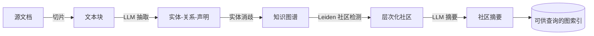

# GraphRAG 简介


你有没有遇到过这种情况：公司丢给你 10 万份内部事件报告，问你 **"过去三年里，攻击模式呈现出哪些新趋势？"** 你把这堆文档丢给传统 RAG 系统，它会按相似度捞出 Top-K 个最相关的文档块，让大模型基于这些片段作答。听起来很合理对吧？

问题来了：大模型拿到的只是 10 万份报告里"和'攻击趋势'长得最像"的几十个片段。它 **根本没有通读过完整语料** ，怎么回答得出"新趋势"这种 **全局性问题（Global Sensemaking）** ？向量检索的本质是"局部相似"，而全局总结是"通盘理解"，这是两件本质不同的事。

类似的全局性问题还有很多：

- "这家企业涉及的核心人物和主要事件有哪些？"
- "这部小说里的人物关系网络是什么样子？"
- "这套开源代码的架构主题分布如何？"

**GraphRAG**（Graph-based RAG）就是为这类问题而生的。它把 RAG 的检索单元从"文本片段"升级为 "**知识图谱**" ，通过图社区摘要、Map-Reduce 等机制让 LLM 真正具备 **全局感知能力** 。

<!--more-->

## 传统 RAG 的盲区

Gao 等人在综述《[Retrieval-Augmented Generation for Large Language Models: A Survey](https://arxiv.org/abs/2312.10997)》中，把 RAG 范式划分为三个阶段：

| 范式 | 核心特征 | 局限 |
|------|----------|------|
| **Naive RAG** | 切片 → 嵌入 → 向量检索 → 生成 | 检索质量差，易"答非所问" |
| **Advanced RAG** | 引入查询重写、重排序、混合检索等 | 仍是"局部片段"的拼凑 |
| **Modular RAG** | 模块化编排，结合搜索/路由/记忆等 | 灵活但仍未解决全局问题 |

传统 RAG（以及 Advanced RAG）的共性瓶颈，可以用论文《[Seven Failure Points When Engineering RAG Systems](https://arxiv.org/abs/2401.05856)》总结的 7 个失败点来概括。其中 **第7点"答案不完整"** 最致命：

> 仅基于上下文提供的内容生成答案，会导致回答的内容不够完整。比如问"文档 A、B 和 C 的主流观点是什么？"，更好的方法是分别提问并总结。

向量检索擅长"找相似"，但对"做总结"无能为力。GraphRAG 正是为填补这个空白而提出的代表性方案。

## 什么是 GraphRAG

需要先澄清：**"GraphRAG"这个词现在有两种含义**，在阅读资料时容易混淆。

**狭义上**，它特指微软研究院 2024 年提出的《[From Local to Global: A Graph RAG Approach to Query-Focused Summarization](https://arxiv.org/abs/2404.16130)》中的具体方案。其核心创新有四点：

1. 用 LLM 从文本中抽取**实体-关系-声明**，构建知识图谱；
2. 用 Leiden 算法对图进行**社区检测（Community Detection）**，生成层次化社区；
3. 为每个社区预生成**社区摘要**；
4. 查询时用 **Map-Reduce**（映射-归约）方式汇总所有相关社区的答案。

**广义上**，它是一类**"使用图结构进行检索的 RAG 模式"**，具体包含：

- **基础模式**：Basic Retriever、Cypher Templates、Graph-Enhanced Vector Search
- **高级模式**：Local Retriever、Global Community Summary Retriever、Hypothetical Question Retriever
- **图谱模型**：Domain Graph、Lexical Graph、Parent-Child Lexical Graph、Memory Graph 等

不同模式适配不同的图结构和数据形态，适用边界差异明显。本文主要聚焦在微软的"全局社区摘要"方案上——它是当下最被广泛讨论的实现。

## 核心原理

GraphRAG 的索引阶段可以拆成 5 步。一图胜千言：



查询时，系统对每个社区摘要独立生成"部分答案"（Map），再汇总成"全局答案"（Reduce）。下面分步拆解。

### 第一步：分块与实体抽取

给定一段文本，LLM 被提示提取其中的关键实体、关系，以及关于实体的事实性声明。论文给出的例子很直观：

> "NeoChip（NC）的股票在 NewTech 交易所上市首周飙升……NeoChip 前身为私人实体，于 2016 年被 Quantum Systems 收购。"

LLM 会抽出：

- 实体 **NeoChip**，描述为"一家专注于低功耗处理器的上市公司"
- 实体 **Quantum Systems**，描述为"此前拥有 NeoChip 的公司"
- 关系 **Quantum Systems 于 2016 年起拥有 NeoChip，直至 NeoChip 上市**
- 声明 "NeoChip 的股票在 NewTech 交易所上市首周飙升" 等

这一步的关键设计参数是**文本块大小**。块越大，LLM 调用次数越少（成本低），但早期信息的**召回率会下降**（所谓"lost in the middle"问题）。论文实验中采用 600 token 的块大小、块之间 100 token 重叠，是个不错的起点。

### 第二步：实体消歧与图构建

同一家公司在不同文本块里可能被叫成 "NC"、"NeoChip"、"NeoChip Inc."。GraphRAG 默认使用**精确字符串匹配**做**实体消歧（Entity Disambiguation）**，把所有匹配的实例聚合为图中的单一节点。关系和声明的重复出现次数则作为**边权重**。

### 第三步：Leiden 社区检测

这一步是 GraphRAG 的灵魂。Leiden 算法（及其前身 Louvain）能把图按连接紧密程度**层次化地**划分成社区——大的社区里嵌套小的社区，直到无法再分为止。

在论文的播客转录数据集上，这个层次划分产生了 1310 个叶级社区，逐级向上递归，最终收敛到 34 个根级社区（C0）。这种层次结构天然适合**分而治之的摘要策略**。

### 第四步：社区摘要

对每个社区，GraphRAG 都会用 LLM 生成一份"类似报告"的摘要，内容涵盖：

- 核心实体及其描述；
- 实体间关系；
- 重要声明（关于时间、事件、互动的关键事实）。

叶级社区的元素摘要按"显著性"（即节点的连接度——连接越多越重要）降序排列，逐个塞进 LLM 上下文窗口。较高级别社区的摘要则递归地用子社区摘要拼装。这种**自底向上**的摘要机制，确保了每个层级都拥有"全局视角"。

### 第五步：Map-Reduce 回答

当用户问"数据集主要讨论什么主题？"时，系统会执行三阶段：

1. **准备阶段**：把同一层级的社区摘要随机打乱分块，避免相关信息都堆在同一个上下文窗口；
2. **Map 阶段**：LLM 对每块独立生成"部分答案"，并给出一个 0~100 的**帮助度分数**，分数为 0 的答案被过滤；
3. **Reduce 阶段**：按帮助度排序，逐个塞进最终的上下文窗口，生成"全局答案"返回给用户。

这一整套机制正是论文标题 **"From Local to Global"** 的含义：在索引阶段把局部文本织成全局图，在查询阶段把全局图再次回退为局部答案，最终拼成全局结论。

## 效果对比

论文在两个百万 token 级别的真实语料（播客转录、新闻文章）上做了头对头评测。**以下胜率由 LLM-as-Judge 评测得出**，即用另一个 LLM 担任"裁判"对比两种答案的优劣，核心结论如下：

| 维度 | 向量 RAG（SS） | GraphRAG | 差异 |
|------|----------------|----------|------|
| 全面性（Comprehensiveness） | 基线 | 胜率 72%~83% | 显著优于（p<.001） |
| 多样性（Diversity） | 基线 | 胜率 62%~82% | 显著优于（p<.01） |
| 赋能性（Empowerment） | 基线 | 混合结果 | 略优，差异不显著 |
| 直接性（Directness） | 最直接 | 较弱 | 向量 RAG 胜出 |

在 **Token 成本**上，GraphRAG 优势也很明显：根级社区摘要（C0）回答每个查询只需要向量 RAG **2.6% 的 token**——也就是大约 40 倍的压缩比。

不过有一个反直觉的发现：GraphRAG 在**直接性**上反而输给向量 RAG。原因是社区摘要抽象程度高，回答"绕"且"完整"，而向量 RAG 直接引用具体片段更"干脆"。这提醒我们：

- **向量 RAG 适合**：精确事实查询、引用溯源；
- **GraphRAG 适合**：全局总结、主题发现、跨文档关系梳理。

## 工程实现

理论的优雅不等于工程好做。蚂蚁集团开源的 DB-GPT + OpenSPG + TuGraph 组合，给出了一个相对完整的工业参考。它的索引阶段核心代码简化后长这样：

```python
# 三元组抽取提示词（受 LlamaIndex 启发）：引导 LLM 吐出 (主, 谓, 宾) 结构
TRIPLET_EXTRACT_PT = """
Some text is provided below. Given the text,
extract up to knowledge triplets as more as possible
in the form of (subject, predicate, object).
...
Text: {text}
Triplets:
"""

# 索引阶段：抽完三元组直接写入图数据库
async def aload_document(self, chunks: List[Chunk]) -> List[str]:
    for chunk in chunks:
        triplets = await self._triplet_extractor.extract(chunk.content)
        for triplet in triplets:
            self._graph_store.insert_triplet(*triplet)  # 底层转成 Cypher
    return [chunk.chunk_id for chunk in chunks]
```

检索时则是经典的"关键词提取 → 子图遍历"：

```cypher
// 从关键词节点出发，探索 2 跳内的局部子图
MATCH p=(n:Entity)-[r:Relation*1..2]-(m:Entity)
WHERE n.id IN ['Alice', 'Bob']
RETURN p
LIMIT 100
```

这和微软的"社区摘要"路线有所不同，代表的是**子图召回路线**——更擅长精确的多跳关系查询，不太适合全局总结任务。两条路线各有适用场景，实际项目中常需根据问题类型**混合使用**。

如果你想快速体验，社区上有两个不错的起点：

- 微软官方 [microsoft/graphrag](https://github.com/microsoft/graphrag) 仓库提供 5 分钟 Quick Start；
- 想换 Neo4j 体验可看 [neo4j-graphrag](https://github.com/neo4j/neo4j-graphrag-python) Python SDK。

## 什么时候用

**问"X 是什么 / 在哪里 / 何时发生"** —— 用向量 RAG 即可，简单直接。

**问"X 与 Y 有什么关系"（多跳推理）** —— 用子图召回路线，例如上文蚂蚁的方案。

**问"整体上是什么 / 主题 / 趋势"** —— 用 GraphRAG（社区摘要），把语料织成图再做摘要。

更具体地说，**适合用 GraphRAG 的场景**包括：

- 需要对**整个语料库**做主题/趋势/模式总结的问题；
- 实体关系密集的领域：法律案件分析、医疗文献调研、企业尽调；
- 长文档集合（几十万到百万 token 级别）；
- 问答结果需要**可解释的引用链**（实体→关系→原文）。

**不适合 / 仍需谨慎的场景**包括：

- 简单事实查询（查"X 的生日是几号"），向量 RAG 更经济；
- 语料库规模很小（< 几千文档），建图的成本得不偿失；
- 对**实时性**要求极高的流式数据，索引构建有滞后；
- 实体抽取质量差的领域（如口语化聊天记录），需先解决抽取问题。

**当下的开放挑战**：

1. **抽取质量上限**：三元组抽取强依赖 LLM 能力，通用模型在专业领域（法律、医学）效果不稳定，常需微调专用模型（如 OneKE）；
2. **查询生成的边界控制**："推理边界"——该召回多少子图、召回哪些节点——缺乏成熟方案；
3. **增量更新困难**：图索引一旦建好，新增文档需要重跑社区检测，工程上不够友好；
4. **评估标准缺失**：全局性问题的回答没有标准答案，论文提出的 LLM-as-Judge + 事实声明聚类是当下最务实的折中。

## 总结

GraphRAG 不是一个"取代向量 RAG"的银弹，而是对 RAG 工具箱的**关键补全**。它的核心思想可以浓缩为一句话：**用结构化（知识图谱）对抗非结构化（长文本），用全局视角对抗局部相似**。代价是更复杂的索引流程和更高的构建成本。

如果你正准备在企业知识库、研报分析、代码库理解等场景落地 RAG，不妨先按上文的问题分类把问题列表分一下类，再决定是否引入 GraphRAG 作为补充——而不是一上来就"All in"。

想深入原始论文可看 [微软研究院博客](https://www.microsoft.com/en-us/research/blog/graphrag-unlocking-llm-discovery-on-narrative-private-data/) 与论文 [arXiv:2404.16130](https://arxiv.org/abs/2404.16130)。

